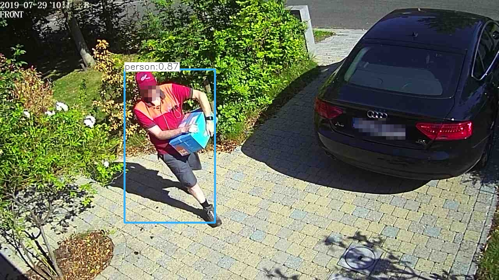

## AI Intruder

Artificial Intelligence backed Intruder detection for home security cameras.
   

    
  
The goal of this project is near 100% accuracy, never miss an intruder but avoid false positives in challenging environments and circumstances. 
  
Tested with Foscam FI9853EP outdoor IP camera's.
  
- leverages camera build in movement detection algorithm to trigger the Neural Network analysis, this to reduce power consumption and CPU resources.
- every suspicious movement is analyzed by a Neural Network (yolov3) which filters the false positives and only triggers when the objects of interest are actually seen (like a person, cat)
  

### Dependencies
- make dependencies
  
(you need a number of others in order to build but its pretty trivial to figure this out)
  
  
#### BUILD
- install opencv4
- make
 

### Run  
./aiintruder -c /conf/aiintruder.cfg 
  
 
### Email notifications  
see: notify.sh  
 - sudo apt install ssmtp
  

### Raspberry PI
Aiintruder is tested on on a raspberry PI 3B+

| Algorithm   | Memory  | Decode JPEG |
|-------------|---------|-------------| 
|Yolo v3      | ~560 MB | ~12 Sec     | 
|Yolo v3 tiny | ~160 MB | ~2 Sec      | 

The time listed to decode is important, in the sense that all other images uploaded during this time are dropped for analysis.  

### Todo
- integrate vdecoder an make it build-optional, like on Raspberry PI only Jpegs are used to save resources.  
- notifications take about 2 seconds with my ISP, take this out of the frameanalyzer loop

### LICENSE
Please check the accompanied LICENSE file.  

### Disclaimer
This is a home project, since it was pretty usefull to me I thought it could be usefull for others so I open sourced the code .

#### DISCLAIMER OF LIABILITY: 
I DISCLAIMS LIABILITY FOR INCIDENTAL OR CONSEQUENTIAL DAMAGES and assumes no responsibility or liability for any loss or damage suffered by any person as a result of the use or misuse of any of the information or content on this website and or source source code and or anything related to this project. 

2019 (C)Bruno Keymolen (bruno.keymolen@gmail.com)
